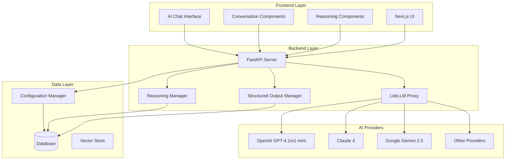
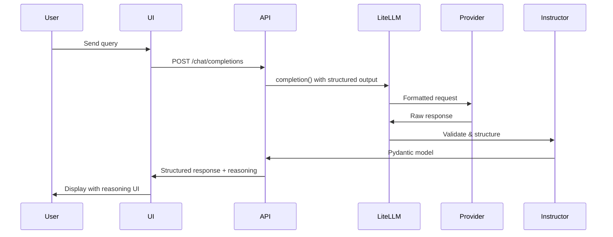

# Design Document

## Overview

This design modernizes Verba's AI capabilities by integrating the latest language models from major providers through LiteLLM as a unified proxy, upgrading to the latest Pydantic v2 models and Instructor for structured outputs, and enhancing the UI with modern AI conversation and reasoning components. The design ensures backward compatibility while providing access to cutting-edge AI capabilities including reasoning and thinking features.

## Architecture

### High-Level Architecture



### Component Integration Flow



## Components and Interfaces

### 1. LiteLLM Integration Layer

#### Core LiteLLM Manager
```python
class LiteLLMManager:
    def __init__(self, config: LiteLLMConfig):
        self.config = config
        self.client = None
        self.fallback_models = []
    
    async def completion(
        self,
        model: str,
        messages: List[Dict],
        response_model: Optional[BaseModel] = None,
        thinking: Optional[Dict] = None,
        **kwargs
    ) -> Union[ModelResponse, BaseModel]
    
    async def get_available_models(self) -> List[ModelInfo]
    
    async def health_check(self, model: str) -> bool
```

#### Model Configuration
```python
class ModelConfig(BaseModel):
    name: str
    provider: str
    api_key: Optional[str] = None
    base_url: Optional[str] = None
    supports_reasoning: bool = False
    supports_structured_output: bool = False
    max_tokens: int = 4096
    cost_per_token: float = 0.0
    
class LiteLLMConfig(BaseModel):
    models: List[ModelConfig]
    default_model: str
    fallback_enabled: bool = True
    retry_config: RetryConfig
    rate_limits: Dict[str, int]
```

### 2. Structured Output System

#### Instructor Integration with LiteLLM
```python
class StructuredOutputManager:
    def __init__(self, litellm_manager: LiteLLMManager):
        self.litellm_manager = litellm_manager
        self.instructor_client = instructor.from_litellm(completion)
        self.async_instructor_client = instructor.from_litellm(acompletion)
    
    async def create_structured_completion(
        self,
        model: str,
        messages: List[Dict],
        response_model: Type[BaseModel],
        max_retries: int = 3,
        **kwargs
    ) -> BaseModel:
        """Create structured completion using Instructor with LiteLLM"""
        return await self.async_instructor_client.chat.completions.create(
            model=model,
            response_model=response_model,
            messages=messages,
            max_retries=max_retries,
            **kwargs
        )
    
    async def create_partial_completion(
        self,
        model: str,
        messages: List[Dict],
        response_model: Type[BaseModel],
        **kwargs
    ) -> AsyncIterator[BaseModel]:
        """Create partial streaming completion with Instructor"""
        async for partial in self.async_instructor_client.chat.completions.create_partial(
            model=model,
            response_model=response_model,
            messages=messages,
            **kwargs
        ):
            yield partial
    
    def create_sync_completion(
        self,
        model: str,
        messages: List[Dict],
        response_model: Type[BaseModel],
        max_retries: int = 3,
        **kwargs
    ) -> BaseModel:
        """Synchronous structured completion for non-async contexts"""
        return self.instructor_client.chat.completions.create(
            model=model,
            response_model=response_model,
            messages=messages,
            max_retries=max_retries,
            **kwargs
        )
```

#### Enhanced Pydantic Models
```python
class RAGResponse(BaseModel):
    """Enhanced RAG response with reasoning capabilities"""
    query: str
    answer: str
    reasoning: Optional[ReasoningProcess] = None
    sources: List[DocumentSource]
    confidence: float = Field(ge=0.0, le=1.0)
    metadata: Dict[str, Any] = Field(default_factory=dict)

class ReasoningProcess(BaseModel):
    """Reasoning process from thinking-capable models"""
    thinking_blocks: List[ThinkingBlock] = Field(default_factory=list)
    reasoning_steps: List[str] = Field(default_factory=list)
    confidence_scores: Dict[str, float] = Field(default_factory=dict)

class ThinkingBlock(BaseModel):
    """Individual thinking block from reasoning models"""
    type: str = "thinking"
    content: str
    timestamp: datetime
    signature: Optional[str] = None
```

### 3. Reasoning and Thinking Manager

#### Reasoning Processor
```python
class ReasoningManager:
    def __init__(self, config: ReasoningConfig):
        self.config = config
        self.thinking_enabled = config.thinking_enabled
        self.budget_tokens = config.budget_tokens
    
    async def process_reasoning_response(
        self,
        response: ModelResponse
    ) -> ReasoningProcess
    
    def extract_thinking_blocks(
        self,
        response: ModelResponse
    ) -> List[ThinkingBlock]
    
    def format_reasoning_for_ui(
        self,
        reasoning: ReasoningProcess
    ) -> Dict[str, Any]
```

### 4. Enhanced API Endpoints

#### New Chat Completions Endpoint
```python
@router.post("/chat/completions/v2")
async def enhanced_chat_completions(
    request: EnhancedChatRequest,
    current_user: User = Depends(get_current_user)
) -> EnhancedChatResponse:
    """Enhanced chat completions with reasoning and structured output"""
    pass

class EnhancedChatRequest(BaseModel):
    model: str
    messages: List[ChatMessage]
    response_format: Optional[Dict[str, Any]] = None
    thinking: Optional[ThinkingConfig] = None
    stream: bool = False
    max_retries: int = 3
    temperature: float = 0.7

class EnhancedChatResponse(BaseModel):
    id: str
    model: str
    choices: List[EnhancedChoice]
    usage: TokenUsage
    reasoning: Optional[ReasoningProcess] = None

class EnhancedChoice(BaseModel):
    index: int
    message: ChatMessage
    finish_reason: str
    reasoning_content: Optional[str] = None
    thinking_blocks: List[ThinkingBlock] = Field(default_factory=list)
```

### 5. Frontend UI Components

#### AI Reasoning Component
```typescript
interface ReasoningComponentProps {
  reasoning: ReasoningProcess;
  isExpanded?: boolean;
  onToggle?: () => void;
  showSteps?: boolean;
  showConfidence?: boolean;
}

export const AIReasoningComponent: React.FC<ReasoningComponentProps> = ({
  reasoning,
  isExpanded = false,
  onToggle,
  showSteps = true,
  showConfidence = true
}) => {
  // Component implementation with expandable thinking blocks
  // Visual indicators for reasoning stages
  // Confidence score displays
  // Step-by-step reasoning visualization
};
```

#### Enhanced Conversation Component
```typescript
interface ConversationComponentProps {
  messages: EnhancedMessage[];
  onSendMessage: (message: string) => void;
  isLoading?: boolean;
  showReasoning?: boolean;
  modelConfig?: ModelConfig;
}

interface EnhancedMessage {
  id: string;
  role: 'user' | 'assistant' | 'system';
  content: string;
  reasoning?: ReasoningProcess;
  timestamp: Date;
  model?: string;
  metadata?: Record<string, any>;
}

export const EnhancedConversationComponent: React.FC<ConversationComponentProps> = ({
  messages,
  onSendMessage,
  isLoading = false,
  showReasoning = true,
  modelConfig
}) => {
  // Enhanced message rendering with reasoning support
  // Rich formatting for code blocks and markdown
  // Message threading and references
  // Model-specific UI adaptations
};
```

## Data Models

### Database Schema Updates

#### Model Configurations Table
```sql
CREATE TABLE model_configurations (
    id UUID PRIMARY KEY DEFAULT gen_random_uuid(),
    name VARCHAR(255) NOT NULL,
    provider VARCHAR(100) NOT NULL,
    model_id VARCHAR(255) NOT NULL,
    api_key_encrypted TEXT,
    base_url VARCHAR(500),
    supports_reasoning BOOLEAN DEFAULT FALSE,
    supports_structured_output BOOLEAN DEFAULT FALSE,
    max_tokens INTEGER DEFAULT 4096,
    cost_per_token DECIMAL(10, 8) DEFAULT 0.0,
    is_active BOOLEAN DEFAULT TRUE,
    created_at TIMESTAMP DEFAULT NOW(),
    updated_at TIMESTAMP DEFAULT NOW()
);
```

#### Reasoning Sessions Table
```sql
CREATE TABLE reasoning_sessions (
    id UUID PRIMARY KEY DEFAULT gen_random_uuid(),
    chat_session_id UUID REFERENCES chat_sessions(id),
    model_name VARCHAR(255) NOT NULL,
    thinking_blocks JSONB,
    reasoning_steps JSONB,
    confidence_scores JSONB,
    token_usage JSONB,
    created_at TIMESTAMP DEFAULT NOW()
);
```

#### Enhanced Chat Messages Table
```sql
ALTER TABLE chat_messages ADD COLUMN reasoning_session_id UUID REFERENCES reasoning_sessions(id);
ALTER TABLE chat_messages ADD COLUMN structured_output JSONB;
ALTER TABLE chat_messages ADD COLUMN model_metadata JSONB;
```

### Configuration Models

#### Environment Configuration
```python
class AIModelsConfig(BaseModel):
    # OpenAI Configuration
    openai_api_key: Optional[str] = None
    openai_models: List[str] = ["gpt-4.1", "o1-mini"]
    
    # Anthropic Configuration
    anthropic_api_key: Optional[str] = None
    anthropic_models: List[str] = ["claude-4-sonnet", "claude-4-haiku"]
    
    # Google Configuration
    google_api_key: Optional[str] = None
    google_models: List[str] = ["gemini-2.5-flash", "gemini-2.5-pro"]
    
    # LiteLLM Configuration
    litellm_proxy_url: Optional[str] = None
    litellm_api_key: Optional[str] = None
    
    # PostgreSQL Observability Configuration
    database_url: Optional[str] = None
    observability_table_name: str = "verba_llm_logs"
    enable_observability_logging: bool = True
    
    # Reasoning Configuration
    default_thinking_budget: int = 2048
    enable_reasoning_by_default: bool = True
    
    # Structured Output Configuration
    max_retries: int = 3
    validation_enabled: bool = True
    instructor_mode: str = "JSON_SCHEMA"  # or "TOOLS", "ANTHROPIC_TOOLS", etc.
```

## Error Handling

### Error Types and Recovery

#### LiteLLM Error Handling
```python
class ModelError(Exception):
    """Base exception for model-related errors"""
    pass

class ModelUnavailableError(ModelError):
    """Raised when a model is temporarily unavailable"""
    pass

class StructuredOutputError(ModelError):
    """Raised when structured output validation fails"""
    pass

class ReasoningError(ModelError):
    """Raised when reasoning processing fails"""
    pass

class ErrorHandler:
    async def handle_model_error(
        self,
        error: Exception,
        context: Dict[str, Any]
    ) -> Optional[ModelResponse]:
        """Handle model errors with fallback strategies"""
        
    async def retry_with_fallback(
        self,
        original_request: Dict[str, Any],
        failed_model: str
    ) -> ModelResponse:
        """Retry request with fallback model"""
```

### Graceful Degradation

#### Fallback Strategies
1. **Model Fallback**: Automatic fallback to alternative models when primary model fails
2. **Feature Degradation**: Disable reasoning features if not supported by fallback model
3. **Structured Output Fallback**: Fall back to JSON mode if schema validation fails
4. **UI Adaptation**: Adapt UI components based on available model capabilities

## Testing Strategy

### Unit Testing

#### LiteLLM Integration Tests
```python
class TestLiteLLMManager:
    async def test_model_completion(self):
        """Test basic model completion functionality"""
        
    async def test_structured_output(self):
        """Test structured output with Pydantic models"""
        
    async def test_reasoning_extraction(self):
        """Test reasoning and thinking block extraction"""
        
    async def test_fallback_behavior(self):
        """Test fallback to alternative models"""
```

#### Structured Output Tests
```python
class TestStructuredOutputManager:
    async def test_pydantic_validation(self):
        """Test Pydantic model validation"""
        
    async def test_instructor_integration(self):
        """Test Instructor library integration"""
        
    async def test_partial_streaming(self):
        """Test partial structured output streaming"""
```

### Integration Testing

#### End-to-End API Tests
```python
class TestEnhancedChatAPI:
    async def test_reasoning_enabled_chat(self):
        """Test chat with reasoning enabled"""
        
    async def test_structured_output_chat(self):
        """Test chat with structured output"""
        
    async def test_model_switching(self):
        """Test switching between different models"""
```

#### Frontend Component Tests
```typescript
describe('AIReasoningComponent', () => {
  it('should display thinking blocks correctly', () => {
    // Test reasoning display
  });
  
  it('should handle expand/collapse functionality', () => {
    // Test UI interactions
  });
});

describe('EnhancedConversationComponent', () => {
  it('should render messages with reasoning', () => {
    // Test message rendering
  });
  
  it('should handle model-specific features', () => {
    // Test model adaptation
  });
});
```

### Performance Testing

#### Load Testing Scenarios
1. **Concurrent Reasoning Requests**: Test system under high reasoning workload
2. **Structured Output Performance**: Measure validation and parsing overhead
3. **Model Switching Latency**: Test fallback response times
4. **Memory Usage**: Monitor memory consumption with large reasoning outputs

## Migration Strategy

### Backward Compatibility

#### Legacy API Support
```python
@router.post("/chat/completions")
async def legacy_chat_completions(
    request: ChatRequest
) -> ChatResponse:
    """Legacy endpoint with automatic upgrade to new system"""
    # Convert legacy request to enhanced request
    enhanced_request = convert_legacy_request(request)
    enhanced_response = await enhanced_chat_completions(enhanced_request)
    # Convert back to legacy format
    return convert_to_legacy_response(enhanced_response)
```

#### Configuration Migration
```python
class ConfigMigrator:
    def migrate_v1_to_v2(self, old_config: Dict) -> AIModelsConfig:
        """Migrate old configuration to new format"""
        
    def preserve_user_settings(self, old_config: Dict) -> Dict:
        """Preserve existing user model preferences"""
```

### Deployment Strategy

#### Phased Rollout
1. **Phase 1**: Deploy LiteLLM integration with existing models
2. **Phase 2**: Add new model support (GPT-4.1, Claude 4, Gemini 2.5)
3. **Phase 3**: Enable reasoning and thinking capabilities
4. **Phase 4**: Deploy enhanced UI components
5. **Phase 5**: Full structured output integration

#### Feature Flags
```python
class FeatureFlags:
    LITELLM_ENABLED = "litellm_enabled"
    REASONING_ENABLED = "reasoning_enabled"
    STRUCTURED_OUTPUT_ENABLED = "structured_output_enabled"
    NEW_UI_COMPONENTS = "new_ui_components"
    
    @staticmethod
    def is_enabled(flag: str, user_id: Optional[str] = None) -> bool:
        """Check if feature flag is enabled for user"""
```

## Security Considerations

### API Key Management
- Encrypted storage of provider API keys
- Rotation mechanism for API keys
- Audit logging for API key usage

### Rate Limiting and Cost Control
- Per-user rate limiting for expensive reasoning models
- Cost tracking and budget alerts
- Token usage monitoring and reporting

### Data Privacy
- Reasoning content privacy controls
- Option to disable thinking block storage
- GDPR compliance for reasoning data

## Performance Optimizations

### Caching Strategy
- Model response caching for identical queries
- Reasoning result caching
- Structured output schema caching

### Resource Management
- Connection pooling for LiteLLM
- Memory management for large reasoning outputs
- Async processing for non-blocking operations

### Monitoring and Observability

#### PostgreSQL Integration for Observability
```python
class PostgreSQLObservabilityManager:
    def __init__(self, database_url: str, table_name: str = "verba_llm_logs"):
        self.database_url = database_url
        self.table_name = table_name
        self.setup_callbacks()
    
    def setup_callbacks(self):
        """Configure LiteLLM callbacks for PostgreSQL logging"""
        # Use custom callback for PostgreSQL logging
        litellm.success_callback = ["postgresql_custom"]
        litellm.failure_callback = ["postgresql_custom"]
        
        # Register custom callback function
        self.register_postgresql_callback()
    
    def register_postgresql_callback(self):
        """Register custom PostgreSQL callback with LiteLLM"""
        import litellm
        
        def postgresql_callback(kwargs, completion_response, start_time, end_time):
            """Custom callback to log to PostgreSQL"""
            self.log_to_postgresql(kwargs, completion_response, start_time, end_time)
        
        litellm.callbacks.append(postgresql_callback)
    
    async def log_to_postgresql(self, kwargs, completion_response, start_time, end_time):
        """Log request/response data to PostgreSQL"""
        # Implementation for logging to PostgreSQL
        pass
    
    def identify_user(self, user_id: str):
        """Identify end-user for better tracking"""
        # Store user context for logging
        pass
```

#### PostgreSQL Request Logs Schema
```sql
CREATE TABLE verba_llm_logs (
    id BIGSERIAL PRIMARY KEY,
    created_at TIMESTAMP WITH TIME ZONE DEFAULT NOW(),
    model TEXT DEFAULT '',
    messages JSONB DEFAULT '{}',
    response JSONB DEFAULT '{}',
    end_user TEXT DEFAULT '',
    status TEXT DEFAULT '',
    error JSONB DEFAULT '{}',
    response_time REAL DEFAULT 0,
    total_cost REAL,
    additional_details JSONB DEFAULT '{}',
    litellm_call_id TEXT UNIQUE,
    reasoning_enabled BOOLEAN DEFAULT FALSE,
    thinking_tokens INTEGER DEFAULT 0,
    structured_output_schema TEXT,
    -- Add pgvector support for future embedding analytics
    embedding vector(1536)  -- Adjust dimension as needed
);

-- Create indexes for better query performance
CREATE INDEX idx_verba_llm_logs_created_at ON verba_llm_logs(created_at);
CREATE INDEX idx_verba_llm_logs_model ON verba_llm_logs(model);
CREATE INDEX idx_verba_llm_logs_end_user ON verba_llm_logs(end_user);
CREATE INDEX idx_verba_llm_logs_status ON verba_llm_logs(status);
```

#### Enhanced Observability Features
- Model performance metrics with PostgreSQL analytics
- Reasoning quality metrics and thinking token usage
- Cost and usage analytics with real-time dashboards
- Error rate monitoring and alerting
- User behavior analytics for reasoning features
- A/B testing support for different model configurations
- Vector similarity search for request patterns using pgvector